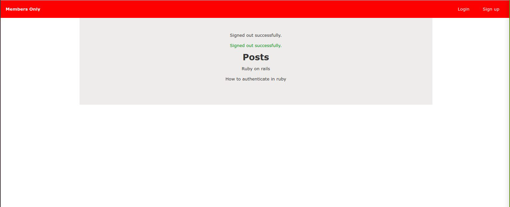

# README

Member-only App.
In this project, we built an exclusive clubhouse where members can write posts, but outside, Non members can only see the story and wonder who wrote it.

## Built With
-Ruby 2.7.0

-Rails 6.0.3.4

-Devise

-Scss

-SQLite3

-VScode

## Getting Started

**Prerequisites**
To get this project up and running locally, you must already have ruby and necessary gems installed on your computer

To get this project set up on your local machine, follow these simple steps:

**Open Terminal.**
- Navigate to your desired location to download the contents of this repository.
- Copy and paste the following code into the Terminal: git clone https://github.com/enaburekhan/Members-only.git
- Cd Members-only
- Add devise 'gem' to your gem file
- Run bundle install
- Run rails db:migrate.

## Author

👤 **Okoli Chijioke**
- Github: [@Ceejayski](https://github.com/ceejayski)
- Twitter: [@Ceejaski1](https://twitter.com/Ceejayski1)
- Linkedin: [Okoli Chijioke](https://www.linkedin.com/in/okoli-ceejay/)

👤 **Eric Enaburekhan**

- Github: [@enaburekhan](https://github.com/enaburekhan)
- Twitter: [@enaburekhaneric](https://twitter.com/enaburekhaneric)
- Linkedin: [@ericenaburekhan](https://www.linkedin.com/in/eric-enaburekhan-801a28100/)

Pls, give us a Star on GitHub — it helps!

memo License
This project is MIT licensed.